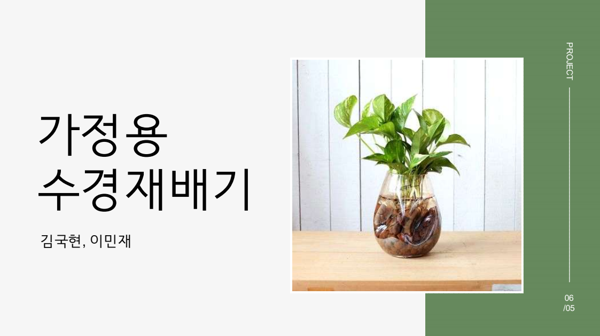
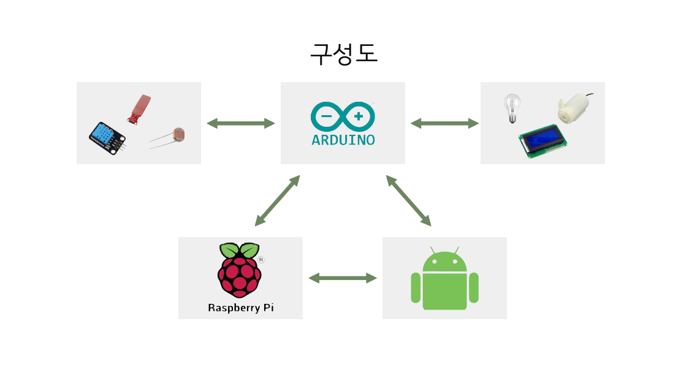
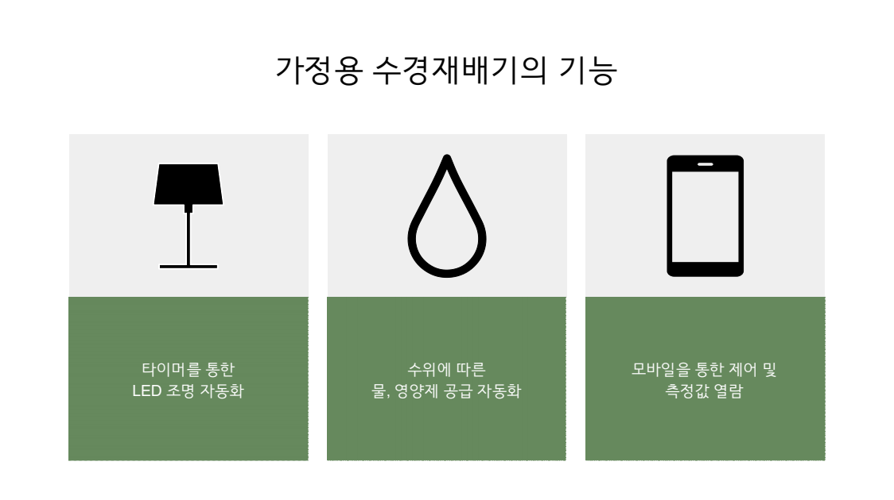

# 가정용 스마트 수경재배기 (Home Hydroponics System)

## 📌 프로젝트 개요
**수경재배(Hydroponics)**란 흙을 사용하지 않고 물과 수용성 영양분으로 만든 배양액으로 식물을 기르는 방식을 의미합니다.  
- 흙 먼지로부터 자유롭고 병충해에 강함  
- 관리가 쉬워 초보자도 쉽게 재배 가능  
- 인테리어 효과를 낼 수 있음  

본 프로젝트에서는 **가정용 스마트 수경재배기**를 제작하여 자동화, 데이터 수집, 모바일 제어 기능을 구현하였습니다.

---

## 🎯 주요 목표
1. **자동화 기능 추가**  
   - 조명 및 수분 공급 자동 제어
2. **모바일 제어 기능**  
   - 사용자가 앱을 통해 제어 및 측정값 확인
3. **데이터 수집 및 활용**  
   - 재배 데이터를 DB에 저장 및 분석

---

## ⚙️ 시스템 구성

### 센서 및 하드웨어
- **온습도 센서 (DHT)**
- **조도 센서**
- **수위 센서**
- **LCD 모듈**
- **워터 펌프 + 호스**
- **LED 조명**

### 기능

- **LED 자동화** : 12시간 주기로 자동 Toggle  
- **수위 제어** : 낮으면 자동 보충, 높으면 자동 차단  
- **실시간 모니터링** : LCD 및 모바일 앱 연동  
- **DB 연동** : 날짜, 시간, 조도, 온도, 습도, 수위 저장 및 조회

---

## 📽️ 시연 시나리오
- LED 조명 자동화 동작
- 수위 변화에 따른 펌프 제어
- 모바일 앱에서 실시간 데이터 확인  
(*시연 영상은 PPT 내 참고*)  

---

## 🔍 프로젝트 고찰

### 어려웠던 점
- 사용자/기업 입장에서 꼭 필요한 기능 정의가 어려움  
- 워터펌프 노이즈 간섭으로 DHT 센서 데이터 출력 장애 발생  

### 느낀 점
- 단순한 프로젝트임에도 예상보다 많은 시간이 소요  
- SQL 데이터 저장 및 전송 과정에 대한 이해 심화  

### 보완할 점
- **정밀 측정** : 수온 센서 추가  
- **내구성 강화** : 조명, 물통, 센서 지지 구조 개선  
- **UI/UX 개선** : 빛의 세기, 수위 조절 등 다양한 제어 옵션  
- **데이터 분석** : 사용자 맞춤 피드백 제공  

## 👨‍💻 제작자 (Authors)

- [김국현](https://github.com/GukHyunE)  
- [이민재](https://github.com/anups-lmj)

 
